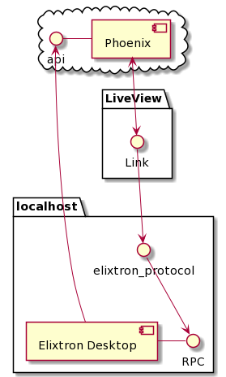

# **Elixtron**

Desktop Features in Phoenix LiveView Applications

### Desktop
https://github.com/johns10/elixtron_desktop
### Web
https://github.com/johns10/elixtron

----
# The Challenge
Open browser, run automation configured by the user in a LiveView Application
## Honorable Mention
Chrome Extension
## Production Solution
Electron App
## Next Solution
Bakeware binary, called from custom protocol, calls Chrome Devtools Protocol locally 

----
# Chrome Extension
LiveView applications get this for free, because LiveView uses pushState for navigation
```
# background.js
chrome.action.onClicked.addListener(function(tab) {
 chrome.windows.create({
	url: "https://dev.elixtron.com:4000",
	type: "popup" 
  }); 
});
```
That's basically it. Call the chrome api from your hooks. Hard code the base url for normal HTTP calls, because they don't use pushState.

----
# Electron Application
LiveView Applications get this for free too
## Context Bridge
```
contextBridge.exposeInMainWorld('elixtron', {
  openBrowser: () => { ipcRenderer.send('openBrowser') }
})
ipcRenderer.on('browserOpened', (event, payload) => browserOpened(payload))
```
## Hooks
```
browserOpener: { mounted() {
      this.handleEvent("open-browser", (message) => {
        window.elixtron.openBrowser()})}}
```

----
# Elixtron Desktop 


## Binary
Assembled with [Bakeware](https://github.com/bake-bake-bake/bakeware), start as daemon or service
## Calls
Rendered directly on the page with custom protocol [elixtron://call()](elixtron://ElixtronDesktop.do_stuff())
## Result
Post responses directly back through API
