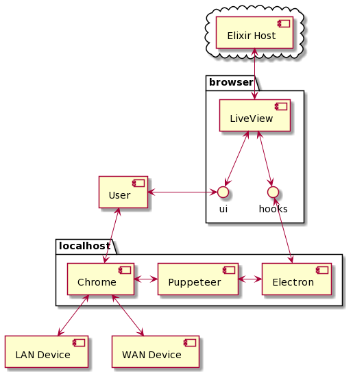
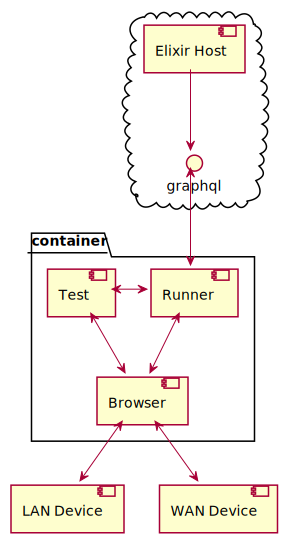

# **Elixtron**

Desktop Features in Phoenix LiveView Applications

### Desktop
https://github.com/johns10/elixtron_desktop
### Web
https://github.com/johns10/elixtron

----


# John Davenport

### Head of Implementations at FunnelCloud
### Founder and only human at UserDocs
### Not this good looking in person

----

# UserDocs
Automatically collects screenshots from web applications running in the user's WAN
## LiveView
Only acts as the web interface for authoring the processes
## localhost
Must open a local browser, and simulate user action

----
# The Challenge
Open browser locally, with users settings, and run automation
## Honorable Mention
Chrome Extension
## Production Solution
Electron App
## Next Solution
Bakeware binary, called from custom protocol, calls Chrome Devtools Protocol locally 

----
# Before You Start
## Use a host name, and make a root CA
Extensions and Elixir will not tolerate any funny business
## Remember window.location
This is where LiveView gets the host name it passes to the Plug when it connects, you can use to avoid name errors, "fix" http calls, and identify which "app" is connecting to the server.

----
# Electron Application
LiveView Applications get this for free too
## Context Bridge
```
contextBridge.exposeInMainWorld('elixtron', {
  openBrowser: () => { ipcRenderer.send('openBrowser') }
})
ipcRenderer.on('browserOpened', (event, payload) => browserOpened(payload))
```
## Hooks
```
browserOpener: { mounted() {
      this.handleEvent("open-browser", (message) => {
        window.elixtron.openBrowser()})}}
```

----
# Elixtron Desktop 


## Binary
Assembled with [Bakeware](https://github.com/bake-bake-bake/bakeware), start as daemon or service
## Calls
Rendered directly on the page with custom protocol [elixtron://call()](elixtron://ElixtronDesktop.do_stuff())
## Result
Post responses directly back through API

----
# It's an Application with a GenServer
Seriously, it's that simple
## Bakeware deploys with mix release
The binary supports a start command, which does the obvious, and an RPC command, which allows calls to the running instance

----

# CICD Stuff
